# llamaUI

A native desktop UI for [llama.cpp](https://github.com/ggerganov/llama.cpp)'s `llama-server`. Built with PySide6 / Qt Widgets, targeting Linux (KDE Wayland + NVIDIA tested). It is **not** a web app wrapped in Electron — it is a real Qt application that talks directly to the llama-server binary.

This project started as a Tauri app, but WebKitGTK crashes on Wayland with NVIDIA explicit-sync unless you apply workaround env vars. That was unacceptable for a daily-driver tool, so the whole thing was rewritten in PySide6. The old Tauri source is still in `src/` and `src-tauri/` for reference, but it is no longer maintained.

## What it does

### Library

<p align="center">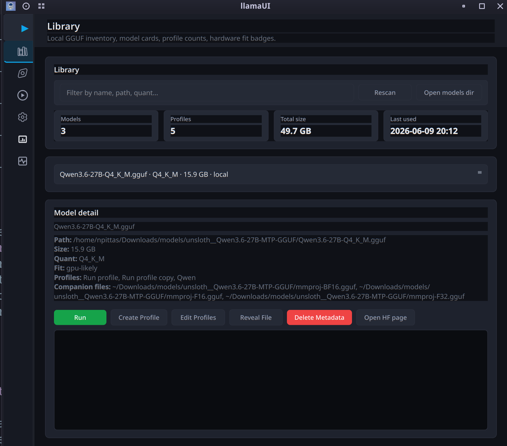</p>

Scan a directory of GGUF files. The scanner distinguishes **primary runnable models** from **companion files** (mmproj, text-encoder, vision-encoder, embedding GGUFs) and links them together. Each model gets a card showing its quant, size, and hardware-fit estimate based on your detected RAM / VRAM. Browse the model's HuggingFace page or reveal the file in your file manager. Per-model profile management with create, duplicate, edit, and delete.

### Discover

<p align="center">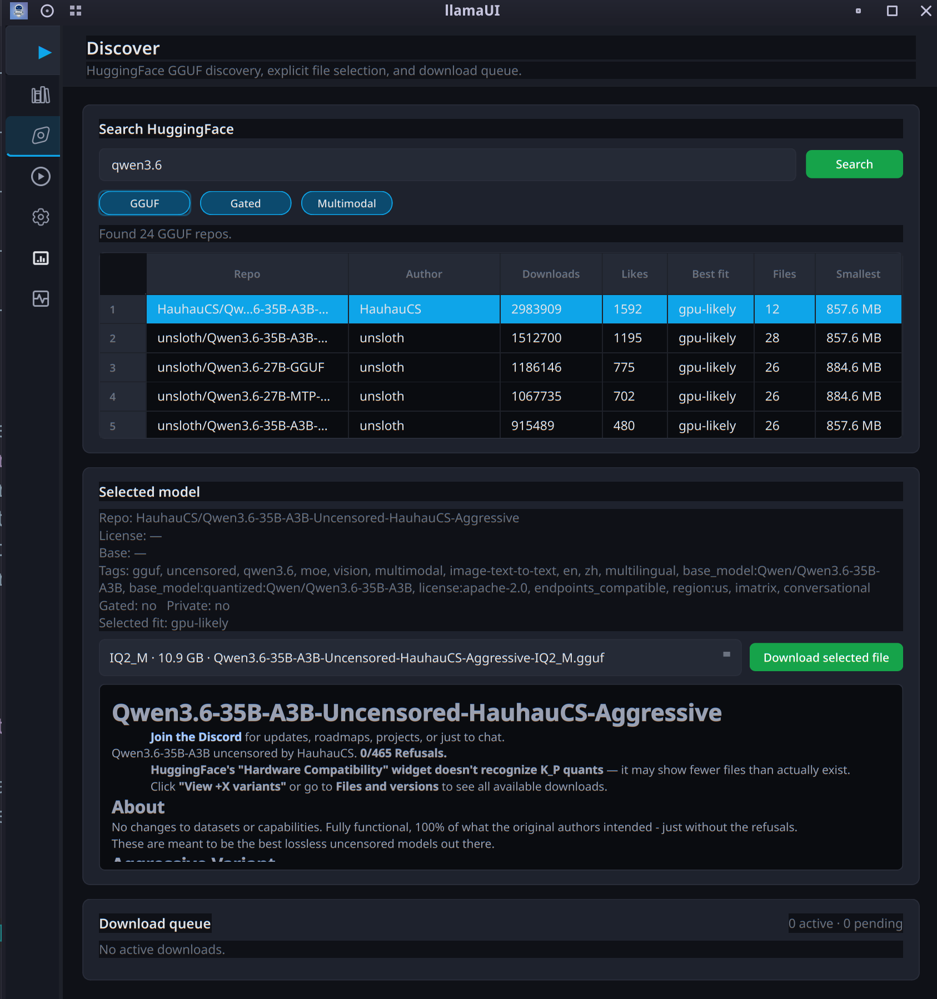</p>

Search HuggingFace for GGUF models. Filter by GGUF format, gated repos, and multimodal support. Results are ranked by a local hardware-fit score instead of popularity alone, using detected GPU VRAM, system RAM, CPU threads, model quant size, companion projectors, MTP/draft files, and long-context KV cache estimates.

<p align="center">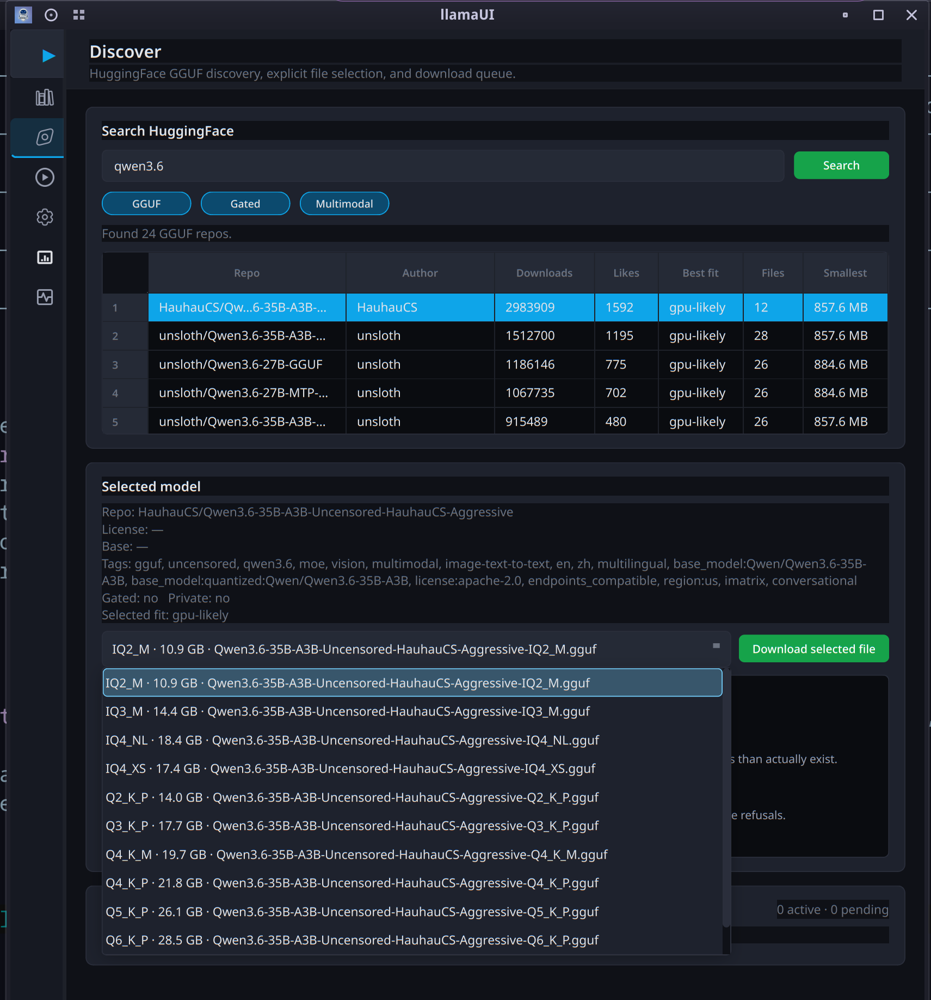</p>

<p align="center">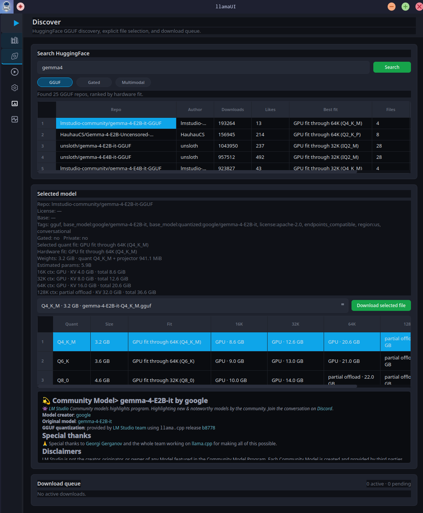</p>

The Discover panel now shows the ranking inputs directly in the UI. In the screenshot, the top results table is sorted by **Best fit** (`GPU fit through 64K`, `GPU fit through 32K`, etc.), while the selected model card expands the current quant into memory estimates for 16K / 32K / 64K / 128K contexts. The quant table compares every available GGUF variant side by side, so selecting `Q4_K_M`, `Q6_K`, `Q8_0`, or another quant immediately recalculates whether each context fits on GPU, requires partial offload, falls back to RAM/CPU, or is likely too large.

Discovery also handles MoE models conservatively: it detects common MoE naming patterns, estimates total/active experts, and shows how many experts are likely GPU-resident versus CPU-offloaded. After a download completes, llamaUI can offer to create a **Recommended** default profile for that model using the selected quant's fit result: context size, GPU layers, flash attention, KV cache type, batch size, micro-batch size, threads, and parallel slots. Model cards are normalized before display so HuggingFace README HTML bullets and tables render as readable Markdown, then cached locally for offline reading.

### Run

The control center. Two modes:

#### Single Model

<p align="center">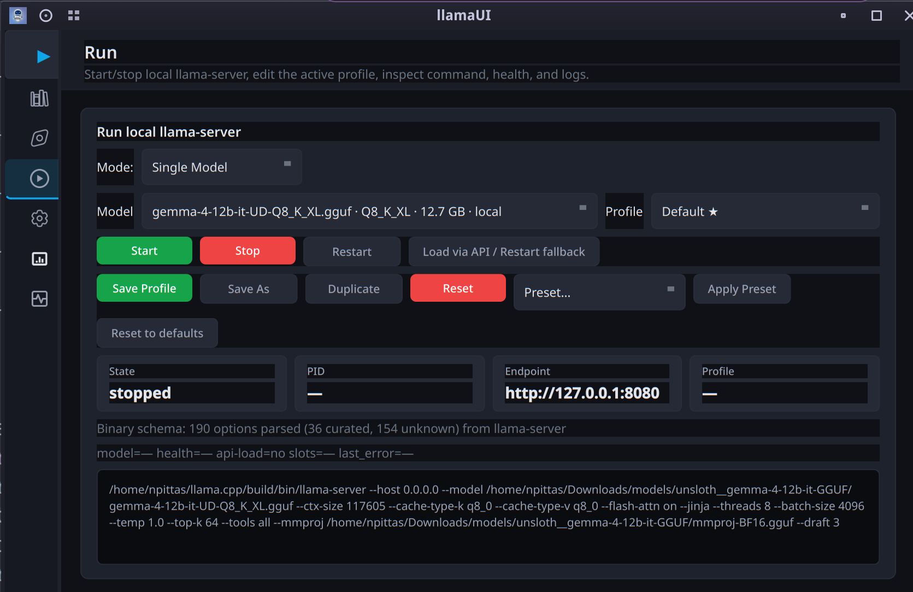</p>

Pick a model and profile, start/stop/restart the server. Live status tiles show state, PID, endpoint, and model name. The command preview shows the exact argv before you start.

<p align="center">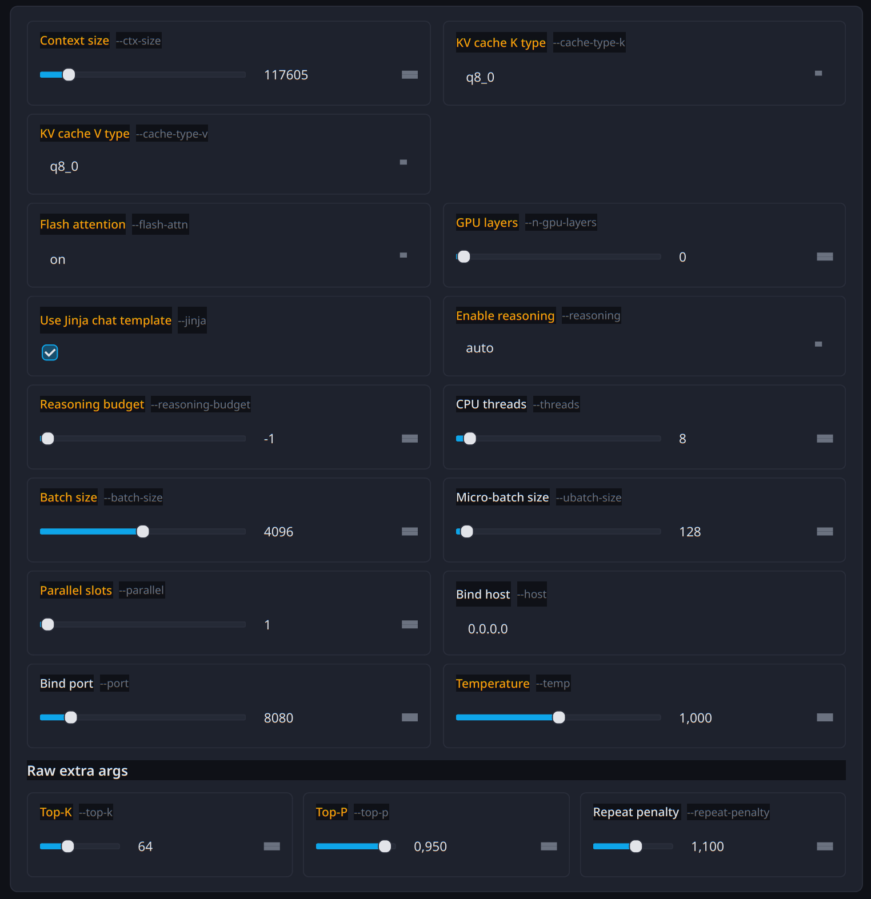</p>

Configure launch arguments through a form UI that mirrors `llama-server --help` (auto-parsed from your binary). Every flag is a typed editor — sliders for numeric values, dropdowns for enums, checkboxes for toggles. Context size, KV cache types, flash attention, GPU layers, batch size, temperature, and more.

<p align="center">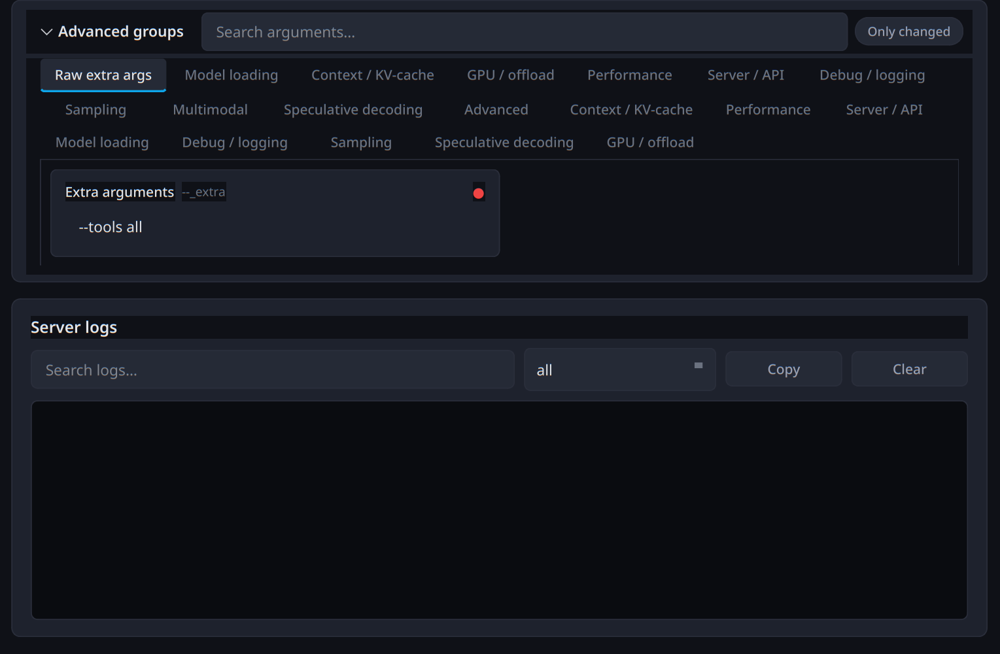</p>

The advanced arguments panel organises every llama-server flag into searchable, tabbed groups — Model loading, Context / KV-cache, GPU / offload, Performance, Server / API, Sampling, Attention, Multimodal, Speculative decoding, and Advanced. A "Raw extra args" tab lets you add arbitrary CLI flags. The "Only changed" toggle filters to options you've modified.

#### Router Mode

<p align="center">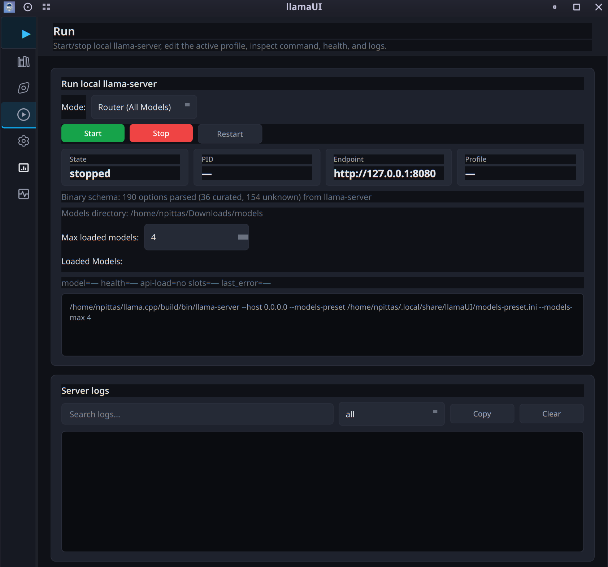</p>

Serve all models from your library via llama-server's native router. The app auto-generates a `--models-preset` INI from your saved profiles, so each model gets its own context size, GPU layers, mmproj, and other settings. Companion GGUFs are automatically excluded. Set max loaded models to control VRAM usage with LRU eviction.

Additional features:
- **Server re-attach**: If llama-server is already running when you open the app, it attaches to the existing process for stop/restart control — no orphaned servers.
- **API health polling**: Live status, token throughput, and model switching.
- **Command preview**: See the exact argv before you start.
- **Live logs**: Auto-tail scrolling with stdout/stderr filtering and search.

### Dashboard

<p align="center">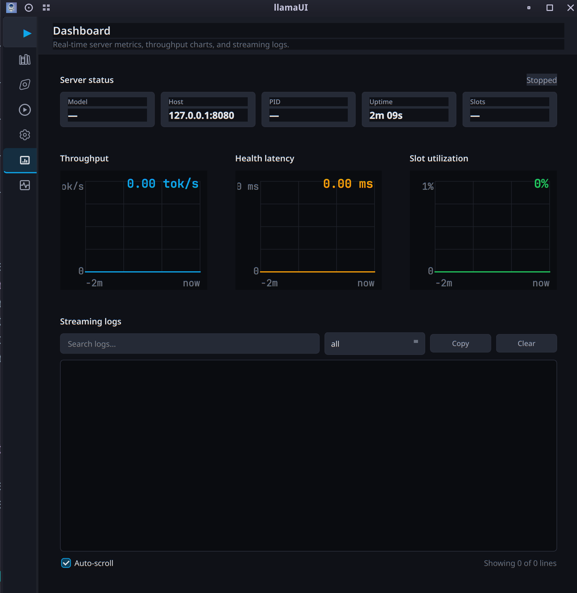</p>

Real-time server metrics and log viewer. Three rolling charts (pure QPainter, zero external dependencies):
- **Throughput** — tokens/sec over time
- **Health latency** — API round-trip time in milliseconds
- **Slot utilization** — active slots vs total, with color flip from green to red at 80%

A status card shows server state, model name, host:port, PID, uptime, and slots. The streaming log viewer reads from the same log buffer as the Run page, with search, source filtering (all/stdout/stderr), copy, clear, auto-scroll toggle, and line count.

### Settings

<p align="center">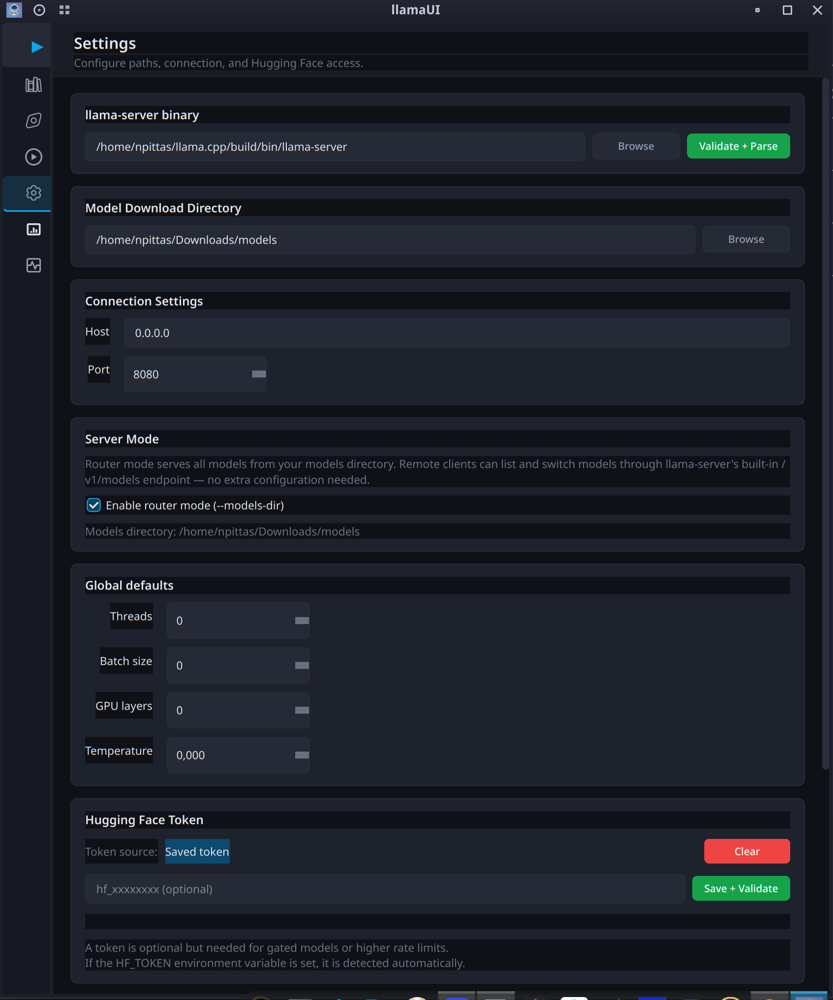</p>

- Point to your `llama-server` binary (with validate + parse).
- Set the models download directory.
- Configure bind host and port (defaults to `0.0.0.0:8080` for LAN access).
- Toggle router mode with models directory.
- HuggingFace token (saved to config, or read from `HF_TOKEN` env var).
- Global defaults for threads, batch size, GPU layers, and temperature.

### Diagnostics

<p align="center">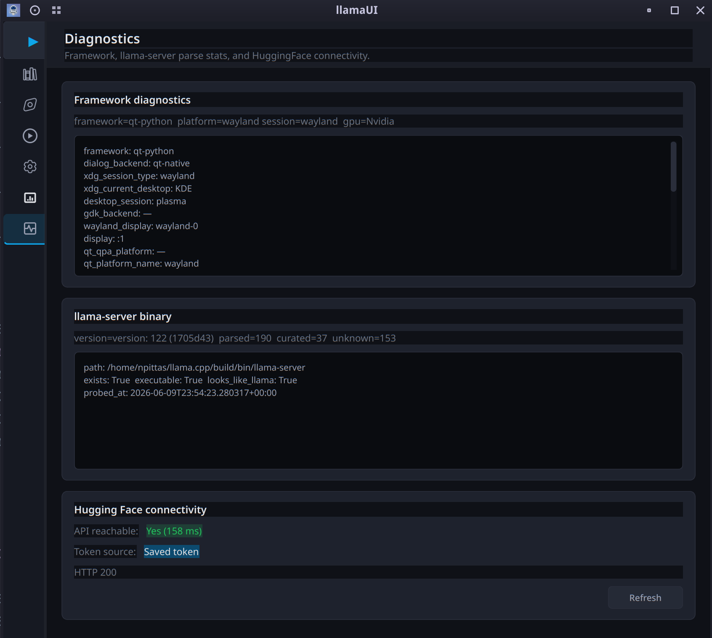</p>

Quick health check: Qt platform plugin and desktop session, llama-server binary presence/version/parsed options count, HuggingFace API reachability with latency and token source.

## Improvements

- **💬 Chat**: (Multimodal Vision, History & System Templates):
Complete documentation for the native Chat tab connected to /v1/chat/completions.
Multimodal Vision support (PNG, JPG, and base64-encoded WEBP images).
Persistent session history (chat_sessions.json).
Customizable System Prompt templates (chat_templates.json).
High-contrast status badges: ONLINE in bright green and OFFLINE in bright red.
Real-time SSE streaming with a stop button.
- **📚 Library**: (Custom Folder Scanning & .bin Auto-Configuration):
Recursive scanning of any system folder with depth control, hidden folders, size filtering, and folder exclusion (node_modules, .git, venv, etc.).
Real-time multithreaded progress dialog with a cancel option.
Automatic configuration of vision projectors using mmproj-*.bin and CLI argument parser (--ctx-size, --n-gpu-layers, --temp, --threads) from .bin files in the model folder.
Featured action buttons: 📂 Scan Custom Folder… in green and 🔄 Rescan in light blue.
- **⚡ Run**: (Control Center, Auto-Discovery & Safety Lock):
Automatic Control Safety Lock: Automatically locks all sliders, spinboxes, text boxes, dropdowns, and preset buttons while the server is running (STARTING, RUNNING, HEALTHY) and automatically unlocks them when the server is stopped.
llama-server.exe Auto-Discovery: Intelligent search engine that detects local executables without manual configuration.
- **🏗️ Architecture**: Requirements & Unit Testing:
Frontend in PySide6 Qt Widgets (without QML, Electron, or Tauri).
Data persistence using versioned JSON wrappers (ConfigStore, LibraryStore, ProfileStore, ChatStore).
Asynchronous tab navigation with deferred_refresh (0 ms lag).
Unit test execution commands (python -m unittest).

## Architecture

- **Frontend**: PySide6 Qt Widgets. No QML. Two-pane splitter layout: collapsible sidebar navigation + page stack. Runtime status lives at the bottom of the sidebar.
- **Data layer**: Plain Python dataclasses + JSON files. `ConfigStore`, `LibraryStore`, and `ProfileStore` each own a versioned JSON envelope with migration hooks. Stores live in `~/.local/share/llamaUI/`.
- **Background tasks**: `QThread` subclasses for search, downloads, and server management. They dispatch updates back to the UI via Qt signals.
- **Option schema**: On first run (or when the binary changes), the app runs `llama-server --help`, parses the output, and caches the schema. The UI stays accurate even if you upgrade llama.cpp and new flags appear.
- **Router preset**: `generate_models_preset()` writes an INI file listing every runnable model with per-model settings from saved profiles. `mmproj` is auto-attached from the library scan. Companion files are excluded. No `--models-dir` needed — the preset alone defines the model catalogue.
- **Dashboard charts**: Pure QPainter rolling line/area charts. No external charting libraries. `deque(maxlen=120)` provides a 2-minute rolling window at the 2-second poll interval.

### Key design decisions
- **No mock data in production paths**. Empty states are honest.
- **QThread subclasses over moveToThread**: `moveToThread` + `QueuedConnection` with Python callables mis-dispatches to the main thread in PySide6, causing bus errors. QThread subclasses avoid this.
- **Process group termination**: Server starts with `start_new_session=True` so `os.killpg` cleans up the entire process tree on Stop.
- **Companion file filtering**: The scanner knows `mmproj-*.gguf`, `*-encoder-*.gguf`, and `*-embedding-*.gguf` are not standalone models. It attaches them to the primary model.
- **Config host/port authoritative**: Profile host/port never overrides saved Settings values.
- **Shared controller injection**: `DashboardPage` receives `RunPage`'s `LlamaServerController` via `set_controller()` from `MainWindow`, so both pages share the same log buffer and health data.

## Requirements

- Python 3.10+
- PySide6 >= 6.6
- Pillow >= 10.0
- A working `llama-server` binary ([build from llama.cpp](https://github.com/ggerganov/llama.cpp) or grab a release)
- Linux with X11 or Wayland (developed on KDE Plasma Wayland + NVIDIA RTX 4090)
- `nvidia-smi` in PATH for GPU detection

## Installation

### Quick start (any OS)

```bash
git clone https://github.com/NickPittas/llamaUI.git
cd llamaUI

# Option 1: pip install (creates 'llamaui' command)
pip install -e .
llamaui

# Option 2: run directly
python -m qt_app

# Option 3: use the launcher script
./llamaui.sh          # Linux/macOS
llamaui.bat           # Windows
```

### System integration (Linux/macOS)

```bash
./install.sh
```

This installs:
- The `llamaui` command via pip
- XDG desktop entry + icons (Linux — shows in app launcher)
- .app bundle stub (macOS — shows in ~/Applications)

On first launch, go to **Settings**, point it at your `llama-server` binary and your models directory, then hit **Scan Library**.

## Project layout

```
llamaUI/
├── qt_app/                 # The application
│   ├── app/
│   │   ├── pages/          # Library, Discover, Run, Dashboard, Settings, Diagnostics
│   │   ├── services/       # HF search, download, runtime, scanner, parser
│   │   ├── widgets/        # Cards, buttons, slider+spinbox, sidebar
│   │   ├── main_window.py  # Two-pane shell layout
│   │   ├── application.py  # QApplication bootstrap + window icon
│   │   └── theme.py        # Dark palette + QSS stylesheet
│   ├── llama_data/         # Models, stores, option catalog, migrations
│   ├── icons/              # App icon at 9 sizes (16px–512px) + nav SVGs
│   ├── tests/              # Smoke tests (no pytest needed)
│   └── main.py             # Entry point (handles all invocation styles)
├── screenshots/            # App screenshots for documentation
├── plans/                  # Architecture decision records
├── pyproject.toml          # pip-installable package definition
├── install.sh              # Cross-platform installer (Linux/macOS)
├── install.bat             # Windows installer
├── llamaui.sh              # Unix launcher
├── llamaui.bat             # Windows launcher
├── src/                    # Old Tauri frontend (archived)
└── src-tauri/              # Old Tauri backend (archived)
```

## Smoke tests

No heavy test framework — just run the smoke files directly:

```bash
python -m qt_app.tests.smoke_section0         # Shell layout sanity
python -m qt_app.tests.smoke_services         # Data stores, scanner, parser
python -m qt_app.tests.smoke_runtime          # build_argv, preset generation
python -m qt_app.tests.smoke_runtime_api      # Server API client
python -m qt_app.tests.smoke_download_manager # Download concurrency
```

These exercise real code paths against temporary directories. No mocks.

## Router mode

llamaUI's router mode uses llama-server's native `--models-preset` feature to serve multiple models simultaneously:

1. **Auto-generates a preset INI** from your library and saved profiles
2. **Each model gets its own settings** — context size, GPU layers, batch size, temperature, mmproj
3. **Companion files filtered** — only actual chat models appear to clients
4. **mmproj auto-attached** — multimodal models work without manual configuration
5. **Max loaded models** — control VRAM usage with LRU eviction
6. **Loaded models panel** — see what's in VRAM, unload on demand

Connect from any OpenAI-compatible client (Odysseus, Open WebUI, etc.) to `http://<host>:<port>`.

## Why not Tauri?

See `plans/framework-decision.md`. In short: WebKitGTK on Wayland + NVIDIA crashes with `Gdk-Message: Error 71 (Protocol error) dispatching to Wayland display.` unless you disable explicit sync, which is not something a user-facing app should require. Qt's native Wayland plugin handles the same hardware without workarounds.

## Known limitations

- Router mode is built on llama-server's experimental router feature. Check your llama.cpp version supports `--models-preset`.
- The download manager is single-file-at-a-time per queue entry.
- Windows and macOS are supported via the launcher scripts but have not been extensively tested.

## License

The project is unlicensed for now. If you use it, you are on your own.
